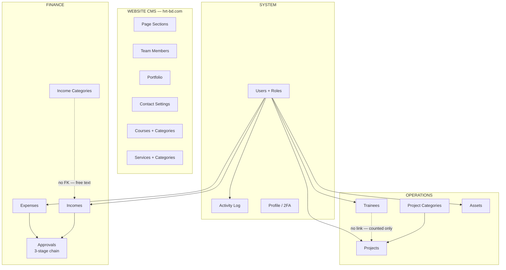
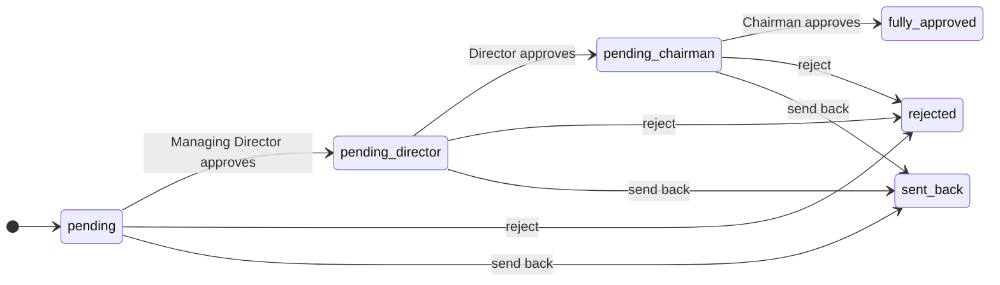
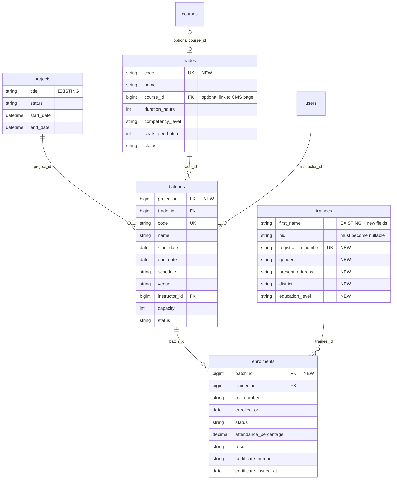
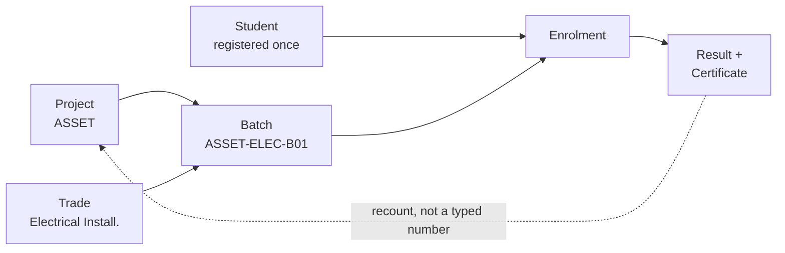

# Admin Modules and Fields

What exists in the admin today, field by field, and what the ASSET student-training work needs on top of it.

Companion to [`backend-map.md`](backend-map.md), which covers routes, middleware and authorization.
This document is about **screens and data**.

---

## Part 1 — The admin today

### 1.1 What the sidebar actually contains

```
Dashboard
Activity Log
Income Management ────── Incomes
                     └── Categories
Expense Management
Project Management ───── Projects
                     ├── Categories
                     └── Trainee
Website CMS ──────────── Page Sections
                     ├── Team Members
                     ├── Portfolio
                     └── Contact Settings
Course CMS ───────────── Courses
                     └── Categories
Service CMS ──────────── Services
                     └── Categories
Asset Management          (only shown if user has assets.manage)
Settings ─────────────── Profile
                     ├── Appearance
                     └── Security
```

Source: `resources/views/layouts/app/sidebar.blade.php`.

Two things are **not** in the sidebar and do not exist anywhere in the admin:

- **User management.** There is no `UserController`, no `users` routes and no screen to create a user or
  change someone's role. The `users.manage` permission is defined and granted to `admin` and `superadmin`,
  but nothing consumes it. Users can only be created by registration or by seeding.
- **Role / permission management.** Roles are six constants in `app/Models/User.php` and their permission
  lists live in `config/permissions.php`. Changing what a role can do is a **code change and a deploy**,
  not an admin action.

### 1.2 The whole system at a glance



The two dotted edges are the structural gaps that matter for the ASSET work. Trainees are not attached to
projects at all — `projects` just stores two integer counters.

---

## Part 2 — Fields, module by module

Legend: **R** = required (NOT NULL, no default) · *italic* = nullable.

### 2.1 Incomes — `income_entries`

Screen: Income Management → Incomes. Controller: `IncomeController`.

| Field | Type | R | Notes |
| --- | --- | :-: | --- |
| `title` | string(255) | ✓ | |
| `source_category` | string(255) | ✓ | **Free text.** Not a FK to `income_categories` |
| `amount` | decimal(15,2) | ✓ | Rendered with ৳ |
| `date` | date | ✓ | |
| *`payment_method`* | string(255) | | |
| *`reference_number`* | string(255) | | |
| *`attachment_path`* | string(255) | | Upload, max 20 MB, `storage/uploads/income` |
| *`description`* | text | | |
| `status` | string(255) | ✓ | Default `pending` — see approval chain |
| *`created_by`* | FK → users | | `nullOnDelete` |

### 2.2 Income Categories — `income_categories`

Screen: Income Management → Categories. Controller: `Finance\IncomeCategoryController`.

| Field | Type | R | Notes |
| --- | --- | :-: | --- |
| `name` | string(255) unique | ✓ | |
| `status` | string(255) | ✓ | Default `active`. Values: `active`, `inactive` |

Seeded with: Membership Fees, Donations, Training Revenue, Event Sponsorship.

### 2.3 Expenses — `expense_entries`

Screen: Expense Management. Controller: `ExpenseController`.

| Field | Type | R | Notes |
| --- | --- | :-: | --- |
| `title` | string(255) | ✓ | |
| `expense_category` | string(255) | ✓ | **Free text. No category table exists at all** |
| `amount` | decimal(15,2) | ✓ | |
| `date` | date | ✓ | |
| *`payment_method`* | string(255) | | |
| *`vendor_name`* | string(255) | | Only field expenses have that incomes do not |
| *`reference_number`* | string(255) | | |
| *`attachment_path`* | string(255) | | |
| *`description`* | text | | |
| `status` | string(255) | ✓ | Default `pending` |
| *`created_by`* | FK → users | | |

### 2.4 Approvals — `approvals`

No screen of its own — surfaced inside the income and expense detail pages.

| Field | Type | R | Notes |
| --- | --- | :-: | --- |
| `approvable_id` + `approvable_type` | morph | ✓ | Points at an income or expense entry |
| `stage` | string(255) | ✓ | `managing_director`, `director`, `chairman` |
| `status` | string(255) | ✓ | `approved`, `rejected`, `sent_back` |
| *`comments`* | text | | |
| *`approved_by`* | FK → users | | |
| *`approved_at`* | timestamp | | |

Unique on `(approvable_type, approvable_id, stage)` — one row per stage per entry, upserted.

**The chain:**



Note there is no arrow out of `sent_back`. See `backend-map.md` section 8.3.

### 2.5 Projects — `projects`

Screen: Project Management → Projects (modal-driven, no separate create/edit pages).

| Field | Type | R | Notes |
| --- | --- | :-: | --- |
| *`project_category_id`* | FK → project_categories | | |
| *`created_by`* | FK → users | | |
| `title` | string(255) | ✓ | |
| `status` | string(255) | ✓ | Default `planning`. Values: `planning`, `active`, `on_hold`, `completed`, `cancelled` |
| `start_date` | datetime | ✓ | |
| *`end_date`* | datetime | | |
| *`targeted_trainees`* | unsigned int | | **A typed number, not a count of rows** |
| `completed_trainees` | unsigned int | ✓ | Default 0. Also a typed number |
| *`description`* | text | | |
| *`notes`* | text | | |

### 2.6 Project Categories — `project_categories`

| Field | Type | R | Notes |
| --- | --- | :-: | --- |
| `name` | string(255) unique | ✓ | |
| `status` | string(255) | ✓ | Default `active` |

### 2.7 Trainees — `trainees`

Screen: Project Management → Trainee. This is the closest thing you have to a student record today.

| Field | Type | R | Notes |
| --- | --- | :-: | --- |
| *`created_by`* | FK → users | | |
| `first_name` | string(255) | ✓ | |
| *`last_name`* | string(255) | | |
| `nid` | string(255) **unique** | ✓ | **Required and unique — blocks under-18 students** |
| *`email`* | string(255) | | |
| *`phone`* | string(255) | | |
| *`date_of_birth`* | date | | |
| *`photo_path`* | string(255) | | |
| *`father_name`* | string(255) | | |
| *`mother_name`* | string(255) | | |
| *`emergency_contact_number`* | string(255) | | |

**No `project_id`. No batch. No trade. No enrolment date. No result or certificate.**

### 2.8 Assets — `assets`

Screen: Asset Management. Gated on `assets.manage`.

| Field | Type | R | Notes |
| --- | --- | :-: | --- |
| `name` | string(255) | ✓ | |
| `code_tag_number` | string(100) unique | ✓ | |
| `category` | string(100) | ✓ | Free text, indexed |
| *`brand`* | string(100) | | |
| *`model`* | string(100) | | |
| *`serial_number`* | string(100) | | |
| *`purchase_date`* | date | | Indexed |
| *`purchase_cost`* | decimal(10,2) | | Caps at ৳99,999,999.99 |
| *`current_value`* | decimal(10,2) | | |
| *`vendor_supplier`* | string(255) | | |
| *`location`* | string(100) | | Indexed |
| *`assigned_user_id`* | FK → users | | Indexed |
| `condition` | **enum** | ✓ | `excellent`, `good`, `fair`, `poor` |
| `status` | **enum** | ✓ | `active`, `in_repair`, `retired`, `lost`, `disposed` |
| *`notes`* | text | | |
| *`attachment_path`* | string(255) | | |

The only two real DB enums in the schema — every other status column is a plain string.

### 2.9 Website CMS — hrt-bd.com

#### Page Sections — `page_sections`

Drives the editable blocks on the public pages.

| Field | Type | R | Notes |
| --- | --- | :-: | --- |
| `page_slug` | string(50) | ✓ | Which page, e.g. `home`, `about` |
| `section_key` | string(50) | ✓ | Which block on that page |
| `title` | string(255) | ✓ | |
| *`subtitle`* | string(255) | | |
| *`description`* | text | | |
| *`image_path`* | string(255) | | |
| *`button_text`* | string(100) | | |
| *`button_link`* | string(255) | | |
| `visibility` | boolean | ✓ | Default true |
| `sort_order` | int | ✓ | Default 0 |

#### Team Members — `team_members`

| Field | Type | R | Notes |
| --- | --- | :-: | --- |
| `name` | string(100) | ✓ | |
| `position` | string(100) | ✓ | |
| *`bio`* | text | | |
| *`image_path`* | string(255) | | |
| *`email`* | string(100) | | |
| *`phone`* | string(20) | | |
| *`social_links`* | json | | |
| `status` | enum | ✓ | `active`, `inactive` |
| `sort_order` | int | ✓ | |

#### Portfolio — `portfolio_items`

| Field | Type | R | Notes |
| --- | --- | :-: | --- |
| `title` | string(255) | ✓ | |
| `slug` | string(100) unique | ✓ | |
| *`description`* | text | | |
| *`image_path`* | string(255) | | |
| *`technologies`* | json | | |
| *`link`* | string(255) | | |
| `status` | enum | ✓ | `draft`, `published` |
| `sort_order` | int | ✓ | |

#### Contact Settings — `contact_settings`

Singleton row. Edit and update only.

| Field | Type | R |
| --- | --- | :-: |
| `email` | string(100) | ✓ |
| *`phone`* | string(20) | |
| *`address`* | string(255) | |
| *`social_links`* | json | |

### 2.10 Course CMS — `courses`, `course_categories`

**This is website content, not an operational course record.** It has slugs, featured images and sort order.

| Field | Type | R | Notes |
| --- | --- | :-: | --- |
| `title` | string(255) | ✓ | |
| `slug` | string(255) unique | ✓ | |
| `short_description` | text | ✓ | |
| *`full_description`* | longtext | | |
| *`featured_image`* | string(255) | | |
| *`category_id`* | FK → course_categories | | |
| *`duration`* | string(255) | | **String**, e.g. "3 months" — not a number |
| `class_type` | string(255) | ✓ | Default `offline` |
| *`location`* | string(255) | | |
| *`schedule_batch`* | string(255) | | **A text label, not a batch record** |
| *`fee`* | string(255) | | **String**, not decimal — cannot be summed |
| *`instructor_name`* | string(255) | | **Free text**, not a FK to users |
| *`course_outline`* | longtext | | |
| `sort_order` | int | ✓ | |
| `status` | string(255) | ✓ | Default `draft` |

`course_categories`: `name` ✓, `slug` unique ✓, *`description`*, `status` (default `published`).

### 2.11 Service CMS — `services`, `service_categories`

| Field | Type | R | Notes |
| --- | --- | :-: | --- |
| `title` | string(255) | ✓ | |
| `slug` | string(255) unique | ✓ | |
| `short_description` | text | ✓ | |
| *`full_description`* | longtext | | |
| *`featured_image`* | string(255) | | |
| *`service_category_id`* | FK → service_categories | | |
| `status` | string(255) | ✓ | Default `draft` |
| `show_on_homepage` | boolean | ✓ | Default false |
| `sort_order` | int | ✓ | |

### 2.12 Users, roles and permissions — `users`

No admin screen. Users are created by registration or seeding.

| Field | Type | R | Notes |
| --- | --- | :-: | --- |
| `name` | string | ✓ | |
| `email` | string unique | ✓ | |
| `password` | string | ✓ | Hashed |
| *`role`* | string | | **One string. Nullable — a user can have no role at all** |
| *`phone`* | string | | |
| *`profile_photo_path`* | string | | |
| *`digital_signature_path`* | string | | Used on approvals |
| `two_factor_type` | string | ✓ | Default `authenticator`. Or `email` |
| *`two_factor_secret`*, *`two_factor_recovery_codes`*, *`two_factor_confirmed_at`* | | | Fortify |

**Roles** (constants in `User.php`): `superadmin`, `admin`, `accountant`, `chairman`,
`managing_director`, `director`.

**Permissions** (`config/permissions.php`): `finance.view`, `finance.manage`, `approvals.manage`,
`users.manage`, `settings.manage`, `cms.manage`, `assets.manage`.

| Role | finance.view | finance.manage | approvals.manage | users.manage | settings.manage | cms.manage | assets.manage |
| --- | :-: | :-: | :-: | :-: | :-: | :-: | :-: |
| `superadmin` | ✓ | ✓ | ✓ | ✓ | ✓ | ✓ | ✓ |
| `admin` | ✓ | ✓ | ✓ | ✓ | ✓ | ✓ | ✓ |
| `accountant` | ✓ | ✓ | ✓ | — | — | ✓ | ✓ |
| `chairman` | ✓ | — | ✓ | — | — | — | — |
| `managing_director` | ✓ | — | ✓ | — | — | — | — |
| `director` | ✓ | — | ✓ | — | — | — | — |

### 2.13 Activity Log — `activity_logs`

Read-only screen. Written automatically by the `LogActivity` middleware.

| Field | Type | Notes |
| --- | --- | --- |
| *`user_id`* | FK → users | |
| *`route_name`* | string | |
| *`action`* | string | HTTP method |
| *`description`* | string | "Visited {route}" |
| *`url`* | text | |
| *`method`* | string | |
| *`ip_address`* | string | |
| *`user_agent`* | text | |

Logs page visits only — it does not record what changed, the old value or the new value.

---

## Part 3 — What the ASSET training work needs

Decisions taken for this design:

1. **Extend `projects` + `trainees`** rather than building a parallel module. ASSET becomes a row in
   `projects`; `trainees` stays the single student roster.
2. **Admin-entered registration.** No public application form for now.
3. **Trades are separate from `courses`.** `courses` stays website content; `trades` becomes the
   operational training unit, with an optional link to its marketing page.

### 3.1 The gap

| You need | You have today | Verdict |
| --- | --- | --- |
| Student registration | `trainees` table | Close — needs more fields, and `nid` must become optional |
| Trade / subject | `courses` (CMS content) | Missing — `courses.duration` and `.fee` are strings |
| Batch | `courses.schedule_batch`, a text label | Missing entirely |
| Student ↔ batch enrolment | nothing | Missing entirely |
| Students per project | `projects.targeted_trainees`, an integer someone types | Missing — no real link |
| Result / certificate | nothing | Missing entirely |
| Role & permission admin | code + config file | Missing — needs a deploy to change |
| User management | nothing | Missing entirely |

### 3.2 Target shape



### 3.3 The operational flow



A student registers **once** and can be enrolled in many batches over time. That is why `enrolments` is a
separate table rather than a `batch_id` column on `trainees`.

### 3.4 Proposed new tables

#### `trades` — the operational training unit

| Field | Type | R | Notes |
| --- | --- | :-: | --- |
| `code` | string(50) unique | ✓ | e.g. `ELEC-101` |
| `name` | string(255) | ✓ | |
| *`course_id`* | FK → courses | | Optional link to the hrt-bd.com page |
| *`description`* | text | | |
| `duration_hours` | unsigned int | ✓ | A **number**, unlike `courses.duration` |
| *`competency_level`* | string(50) | | See the open question below |
| `seats_per_batch` | unsigned int | ✓ | Default capacity for new batches |
| *`fee`* | decimal(10,2) | | A **number**, unlike `courses.fee` |
| `status` | string(20) | ✓ | `active` / `inactive` |

#### `batches` — a cohort running one trade under one project

| Field | Type | R | Notes |
| --- | --- | :-: | --- |
| `project_id` | FK → projects | ✓ | |
| `trade_id` | FK → trades | ✓ | |
| `code` | string(50) unique | ✓ | e.g. `ASSET-ELEC-B01` |
| *`name`* | string(255) | | |
| `start_date` | date | ✓ | |
| *`end_date`* | date | | |
| *`schedule`* | string(255) | | e.g. "Sun–Thu, 9:00–13:00" |
| *`venue`* | string(255) | | |
| *`instructor_id`* | FK → users | | A real FK, unlike `courses.instructor_name` |
| `capacity` | unsigned int | ✓ | Seeded from the trade, editable per batch |
| `status` | string(20) | ✓ | `planned`, `running`, `completed`, `cancelled` |
| *`created_by`* | FK → users | | |

#### `enrolments` — student in a batch

| Field | Type | R | Notes |
| --- | --- | :-: | --- |
| `batch_id` | FK → batches | ✓ | |
| `trainee_id` | FK → trainees | ✓ | |
| *`roll_number`* | string(50) | | Unique within the batch |
| `enrolled_on` | date | ✓ | |
| `status` | string(20) | ✓ | `enrolled`, `in_progress`, `completed`, `dropped`, `failed` |
| *`attendance_percentage`* | decimal(5,2) | | |
| *`result`* | string(50) | | `competent` / `not_competent`, or a grade |
| *`certificate_number`* | string(100) | | |
| *`certificate_issued_at`* | date | | |
| *`remarks`* | text | | |
| *`created_by`* | FK → users | | |

Unique on `(batch_id, trainee_id)` — a student cannot be enrolled twice in the same batch.

### 3.5 Changes to `trainees`

**Required change:** `nid` is currently `string NOT NULL UNIQUE`. Students under 18 have no NID, so
registration will fail for them. Make it **nullable, still unique**, and add `birth_certificate_no`.

New columns for a real registration record:

| Field | Type | Notes |
| --- | --- | --- |
| `registration_number` | string(50) unique | Your own student ID, auto-generated |
| *`birth_certificate_no`* | string(50) | For under-18 students |
| *`gender`* | string(20) | |
| *`present_address`* | text | |
| *`permanent_address`* | text | |
| *`district`* | string(100) | |
| *`upazila`* | string(100) | |
| *`education_level`* | string(100) | |
| *`occupation`* | string(100) | |
| *`guardian_phone`* | string(20) | |
| `status` | string(20) | `active` / `inactive`, default `active` |

If you report participation figures to a government MIS, you will likely also need
`is_disabled` / `disability_type`, `is_ethnic_minority` and a household income band. I have left these out
because I do not know your reporting template — add them only if the template asks for them.

### 3.6 Changes to `projects`

`targeted_trainees` stays as the **target**. `completed_trainees` should stop being a typed number and
become a derived count:

```
completed = enrolments where status = 'completed'
            joined through batches where project_id = this project
```

Keep the column as a cache if you want fast dashboard reads, but recalculate it on enrolment status change
rather than letting staff type it.

### 3.7 Role and permission management

You asked for this and it does not exist. Worse — **right now there is no way to create a user at all.**

- There is no Users screen in the admin.
- Public registration is **switched off**: `config/fortify.php` does not list `Features::registration()`,
  so no `/register` route is registered and nothing in `routes/` adds one.
- So the only ways to add a user are database seeding or direct SQL.

That means you cannot onboard a new Director, and the approval chain cannot be extended to a new person
without a developer.

#### A landmine to be aware of before you switch registration on

The registration plumbing is fully built even though it is disabled: `resources/views/pages/auth/register.blade.php`
exists, `Fortify::registerView()` is registered, and `App\Actions\Fortify\CreateNewUser` accepts a `role`
from the form and validates it only with `Rule::in(User::roles())` — a list that includes `superadmin`.

The form's role dropdown offers **Superadmin, Chairman, Managing Director and Director** (oddly, not Admin
or Accountant). So the moment someone adds `Features::registration()` to `config/fortify.php`, anyone who
can reach the site can create themselves a superadmin account with the `*` permission.

Nothing is exposed today because the route does not exist. But do not enable registration without first
either removing `role` from the form and defaulting it server-side, or restricting the allowed values to
non-privileged roles. Building the Users screen below is the better answer.

Two ways to get there:

| Option | What it means | Cost |
| --- | --- | --- |
| **A. User management only** | Add a Users screen — create, edit, assign role, deactivate — gated on the existing `users.manage` permission that `admin` and `superadmin` already hold and nothing currently uses. Roles and permissions stay in code. | Small: one controller, one screen |
| **B. Full role + permission admin** | Move roles and permissions into `roles`, `permissions`, `permission_role` tables with a matrix screen. Roles become editable without a deploy. | Larger — a migration off `config/permissions.php`, and `hasPermission()` has to read from the DB |

Option A is worth doing regardless — right now you cannot create a Managing Director from the admin at all,
which blocks the approval chain for any new staff member.

Both options need the fix noted in `backend-map.md` section 8.2: `canBeApprovedBy()` checks the role string
directly, so approvals bypass the permission system entirely.

New permissions the training module would need: `training.view`, `training.manage`, `students.manage`.

### 3.8 Proposed sidebar after the work

```
Dashboard
Activity Log
Income Management ────── Incomes
                     └── Categories        gated: finance.categories.manage
Expense Management ───── Expenses
                     └── Categories   NEW  gated: finance.categories.manage
Training Management ──── Students          NEW
                     ├── Trades / Subjects NEW
                     ├── Batches           NEW
                     └── Enrolments        NEW
Project Management ───── Projects, Categories
Website CMS ──────────── Page Sections, Team, Portfolio, Contact
Course CMS ───────────── Courses, Categories
Service CMS ──────────── Services, Categories
Asset Management
Administration ───────── Users             NEW
                     └── Roles & Permissions  NEW (option B only)
Settings ─────────────── Profile, Appearance, Security
```

"Trainee" moves out of Project Management and becomes "Students" under Training Management.

---

## Open questions

These change the schema, so they are worth answering before any migration is written.

1. **Competency levels.** Does ASSET report against NTVQF levels (1–6), or do you use your own
   basic/intermediate/advanced scale? This decides whether `competency_level` is an enum or free text.
2. **Attendance.** Is per-session attendance needed, or is a single percentage per enrolment enough?
   Per-session means one more table and a daily-entry screen.
3. **Assessment.** Is a single `result` per enrolment enough, or do you record marks per module or
   competency unit?
4. **Certificates.** Do you issue them from the system (number, PDF, verification page) or only record a
   number issued elsewhere?
5. **One project or many?** Is ASSET the only training project, or will others run alongside it with
   different trades and reporting?
6. **Expense categories.** Incomes have a category table; expenses do not. Should expenses get one for
   consistency, given ASSET spending will need to be reported by category?
