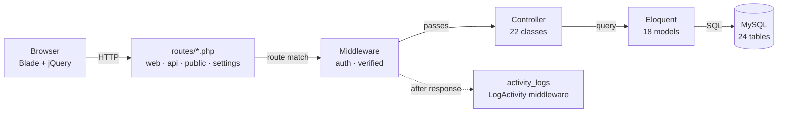
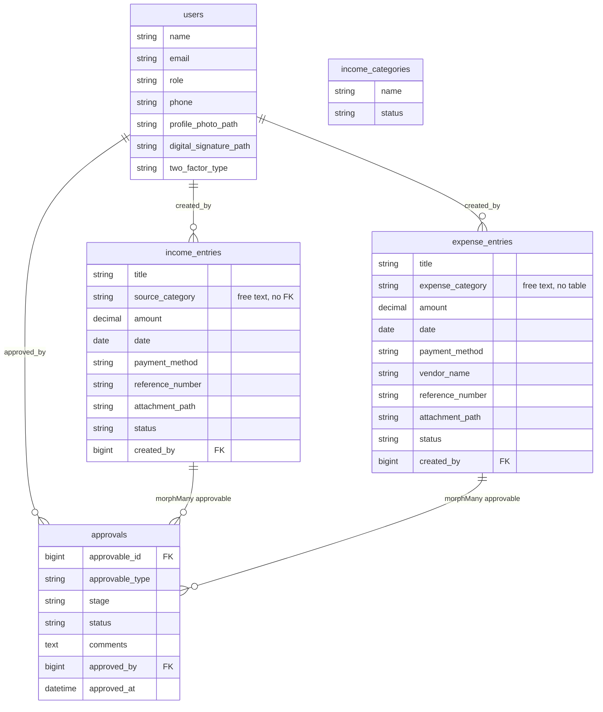
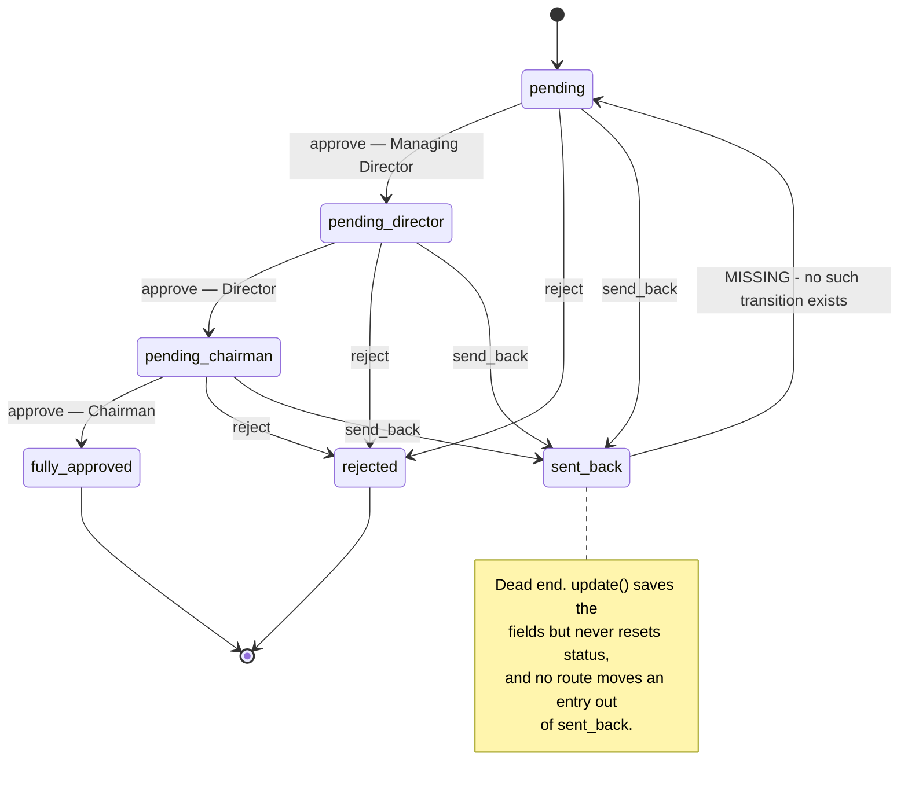
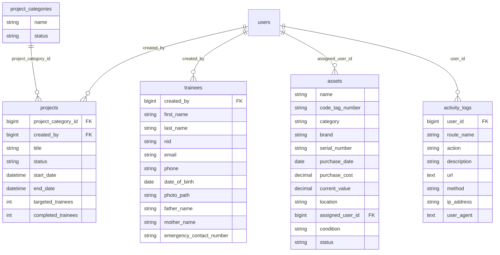
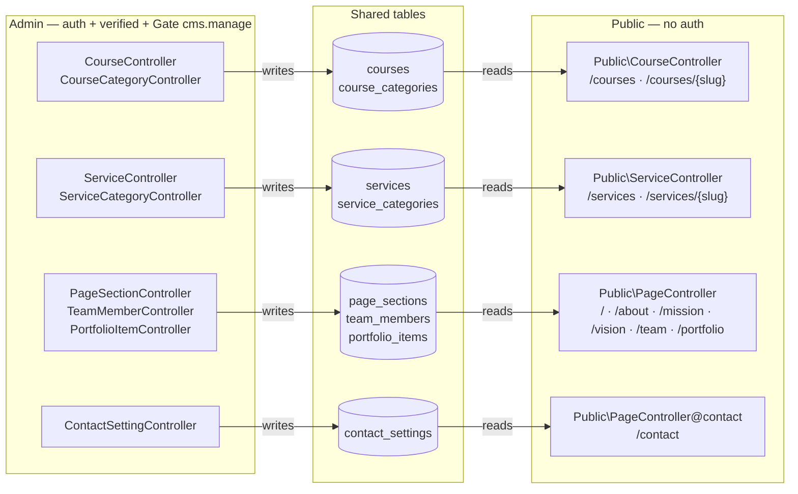

# Backend Map

A structural map of the whole backend: request pipeline, database relations, the approval state machine,
where authorization is actually enforced, and the full route inventory.

Read from the working tree on branch `main`. Diagrams are Mermaid and render in GitHub and in VS Code
with a Markdown preview extension.

| | |
| --- | --- |
| Framework | Laravel 13, Livewire 4, Flux 2, Fortify 1.34, PHP 8.3 |
| Controllers | 22 (plus the base `Controller`) |
| Models | 18 |
| Tables | 24 (16 domain, 8 framework) |
| Migrations | 19 |
| Roles | 6 |
| Permissions | 7 |

---

## 1. How a request moves

Three route files feed one controller layer. There is no service or repository tier — controllers talk to
Eloquent directly, and validation lives inline in each action.



### Middleware groups

Registered in `bootstrap/app.php`:

- `web` group appends `App\Http\Middleware\LogActivity`.
- `api` group appends `App\Http\Middleware\AddApiKeyHeader`.

`LogActivity` runs after the response is produced and writes one `activity_logs` row per authenticated page
view. It skips any route whose name ends in `.data` and skips the `activity.log` route itself, so the table
does not log its own reads.

`AddApiKeyHeader` stamps `X-API-KEY` onto the **response** from `config('app.api_key')`. It does not verify
an inbound key. See [section 8](#8-worth-checking).

---

## 2. Finance and approvals schema

Income and expense are structurally identical twins. Both hang their approval history off a single
polymorphic `approvals` table, so a third approvable type would need no new schema.



`income_categories` is drawn detached on purpose. It is a real table with its own CRUD screen and a JSON
endpoint, but `income_entries.source_category` stores the category **name** as a free string rather than a
foreign key. `expense_entries.expense_category` is a free string too, with no category table behind it at all.

---

## 3. The approval chain

The only real state machine in the codebase. Income and expense implement it separately but identically —
the constants, the transition table and the `approve()` action are duplicated line for line across both
models and both controllers.



### Status constants

Identical on `IncomeEntry` and `ExpenseEntry`:

| Constant | Value | Meaning |
| --- | --- | --- |
| `STATUS_PENDING` | `pending` | Awaiting Managing Director |
| `STATUS_PENDING_DIRECTOR` | `pending_director` | Awaiting Director |
| `STATUS_PENDING_CHAIRMAN` | `pending_chairman` | Awaiting Chairman |
| `STATUS_FULLY_APPROVED` | `fully_approved` | Terminal |
| `STATUS_REJECTED` | `rejected` | Terminal |
| `STATUS_SENT_BACK` | `sent_back` | Currently terminal — see above |

### What `approve()` does

`IncomeController@approve` and `ExpenseController@approve` each perform two writes:

1. Upsert an `approvals` row keyed on `stage`, recording `status`, `comments`, `approved_by` and `approved_at`.
2. Advance the entry's own `status` column via the match block.

Permission is decided by `canBeApprovedBy()`, which matches the current status against the user's **role** —
not against the `approvals.manage` permission. See [section 8](#8-worth-checking).

---

## 4. Operations schema

Projects, trainees, assets and the audit log all attach to `users` and to nothing else. Every foreign key
here is nullable and set to null on delete, so removing a user never cascades.



Note the gap: `projects` carries `targeted_trainees` and `completed_trainees` as plain integers while
`trainees` sits in its own table with no `project_id` and no pivot. The two are counted, not joined.

Project statuses: `planning`, `active`, `on_hold`, `completed`, `cancelled`.

---

## 5. CMS and the public site

The marketing site reads the same tables the admin writes, with no cache and no draft/published copy in
between. A `status` or `visibility` column on each table is what separates a draft from a live page.



Catalog relations: `courses.category_id` → `course_categories`, `services.service_category_id` →
`service_categories`. Both nullable, both `set null` on delete. The four CMS tables — `page_sections`,
`team_members`, `portfolio_items`, `contact_settings` — have no foreign keys at all.

`contact_settings` is a singleton row: its controller exposes only `edit` and `update`.

Every admin controller in this group calls `Gate::authorize('cms.manage')` at the top of each action. This is
the most consistently guarded part of the codebase.

---

## 6. Roles, permissions and gates

Roles are a single string column on `users`. `config/permissions.php` maps each role to a flat permission
list. `AppServiceProvider::registerPermissions()` registers one gate per permission, plus a `Gate::before`
hook that short-circuits the `*` wildcard.

### Role to permission matrix

| Role | finance.view | finance.manage | approvals.manage | users.manage | settings.manage | cms.manage | assets.manage |
| --- | :-: | :-: | :-: | :-: | :-: | :-: | :-: |
| `superadmin` | ✓ | ✓ | ✓ | ✓ | ✓ | ✓ | ✓ |
| `admin` | ✓ | ✓ | ✓ | ✓ | ✓ | ✓ | ✓ |
| `accountant` | ✓ | ✓ | ✓ | — | — | ✓ | ✓ |
| `chairman` | ✓ | — | ✓ | — | — | — | — |
| `managing_director` | ✓ | — | ✓ | — | — | — | — |
| `director` | ✓ | — | ✓ | — | — | — | — |

`superadmin` holds `*`, resolved by the `Gate::before` hook rather than by an explicit list.

### Where each module is actually enforced

Beyond the `auth` + `verified` route middleware:

| Module | Controller | Check inside the action | Effective guard |
| --- | --- | --- | --- |
| CMS — pages, team, portfolio, contact | `Admin\*` | `Gate::authorize('cms.manage')` | permission |
| CMS — courses, services | `Admin\*` | `Gate::authorize('cms.manage')` | permission |
| Assets | `AssetController` | `Gate::authorize('assets.manage')` | permission |
| Income — write | `IncomeController` | `hasPermission('finance.manage')` | permission |
| Expense — write | `ExpenseController` | `hasPermission('finance.manage')` | permission |
| Income / expense — approve | `Income` · `Expense` | `canBeApprovedBy()` | **role match, not permission** |
| Projects | `ProjectController` | none | **login only** |
| Project categories | `ProjectCategoryController` | none | **login only** |
| Trainees | `TraineeController` | none | **login only** |
| Income categories | `Finance\IncomeCategoryController` | none | **login only** |
| Activity log | `ActivityLogController` | none | **login only** |
| Public site | `Public\*` | none | open by design |
| JSON API | `Api\IncomeCategoryApiController` | none | **unauthenticated** |

### Two-factor authentication

Fortify handles 2FA, with a custom provider bound in `AppServiceProvider::register()`
(`App\Auth\TwoFactorAuthenticationProvider`). `users.two_factor_type` selects between `authenticator` and
`email`. For the email type, a `TwoFactorAuthenticationChallenged` listener generates a six-digit code,
stores a hashed `email:<hash>:<expiry>` payload in `two_factor_secret` with a 10-minute expiry, and sends
`App\Notifications\EmailTwoFactorCode`.

---

## 7. Route inventory

Four route files. Routes ending in `/data` are server-side DataTables endpoints that return pre-rendered HTML
cells, not JSON resources.

### `routes/public.php` — no middleware

| Method | URI | Name | Controller |
| --- | --- | --- | --- |
| GET | `/` | `home` | `Public\PageController@home` |
| GET | `/about` `/mission` `/vision` `/team` `/contact` `/portfolio` | `about` … `portfolio` | `Public\PageController` |
| GET | `/work` | — | 301 redirect to `/portfolio` |
| GET | `/courses` `/courses/{slug}` | `courses.index` `courses.show` | `Public\CourseController` |
| GET | `/services` `/services/{slug}` | `services.index` `services.show` | `Public\ServiceController` |

### `routes/api.php` — `AddApiKeyHeader` on the response

| Method | URI | Name | Controller |
| --- | --- | --- | --- |
| GET | `/api/income/categories` | — | `Api\IncomeCategoryApiController@index` |

### `routes/web.php` — `auth` + `verified`

| Method | URI | Name | Controller | Guard |
| --- | --- | --- | --- | --- |
| GET | `dashboard` | `dashboard` | view only | login |
| GET | `activity-log` `activity-log/data` | `activity.log` `.data` | `ActivityLogController` | login only |
| GET | `income` `income/data` `income/create` | `income.index` `.data` `.create` | `IncomeController` | `finance.manage` |
| POST PUT DELETE | `income` `income/{income}` | `income.store` `.update` `.destroy` | `IncomeController` | `finance.manage` |
| GET | `income/{income}` `income/{income}/edit` | `income.show` `.edit` | `IncomeController` | `finance.manage` |
| POST | `income/{income}/approve` | `income.approve` | `IncomeController@approve` | role match |
| GET POST PUT DELETE | `income/categories` `income/categories/{category}` | `income.categories.*` | `Finance\IncomeCategoryController` | login only |
| GET | `expense` `expense/create` | `expense.index` `.create` | `ExpenseController` | `finance.manage` |
| POST PUT DELETE | `expense` `expense/{expense}` | `expense.store` `.update` `.destroy` | `ExpenseController` | `finance.manage` |
| GET | `expense/{expense}` `expense/{expense}/edit` | `expense.show` `.edit` | `ExpenseController` | `finance.manage` |
| POST | `expense/{expense}/approve` | `expense.approve` | `ExpenseController@approve` | role match |
| GET POST PUT DELETE | `projects` `projects/data` `projects/{project}` | `projects.*` | `ProjectController` | login only |
| GET POST PUT DELETE | `projects/categories` `projects/categories/{category}` | `projects.categories.*` | `ProjectCategoryController` | login only |
| GET POST DELETE | `projects/trainees` `projects/trainees/{trainee}` | `projects.trainees.*` | `TraineeController` | login only |
| resource + data | `assets` `assets/data` | `assets.*` | `AssetController` | `assets.manage` |
| resource + data | `admin/cms/page-sections` `team-members` `portfolio` | `admin.*` | `Admin\*Controller` | `cms.manage` |
| GET PUT | `admin/cms/contact-settings` | `admin.contact-settings.*` | `Admin\ContactSettingController` | `cms.manage` |
| resource + data | `admin/courses` `admin/course-categories` | `admin.courses.*` `admin.course-categories.*` | `Admin\Course*Controller` | `cms.manage` |
| resource + data | `admin/services` `admin/service-categories` | `admin.services.*` `admin.service-categories.*` | `Admin\Service*Controller` | `cms.manage` |

All `resource` registrations use `->except(['show'])`.

### `routes/settings.php` — `auth`

| Method | URI | Name | Target |
| --- | --- | --- | --- |
| GET | `settings` | — | redirect to `settings/profile` |
| livewire | `settings/profile` | `profile.edit` | `pages::settings.profile` |
| POST | `settings/profile` | `profile.update` | `Settings\ProfileController@update` |
| DELETE | `settings/profile/profile-photo` | `profile.photo.destroy` | `Settings\ProfileController` |
| DELETE | `settings/profile/digital-signature` | `profile.signature.destroy` | `Settings\ProfileController` |
| livewire | `settings/appearance` | `appearance.edit` | `pages::settings.appearance` (also `verified`) |
| livewire | `settings/security` | `security.edit` | `pages::settings.security` (also `verified` + `password.confirm`) |

---

## 8. Worth checking

Things this map surfaced that look unintentional rather than designed. Ordered by likely cost.

### 8.1 Four modules are protected by login alone

> **Partly fixed.** `Finance\IncomeCategoryController` now calls
> `Gate::authorize('finance.categories.manage')` on every action. The four below are still open.

`ProjectController`, `ProjectCategoryController`, `TraineeController` and `ActivityLogController` run no
`Gate` check and no permission test inside their actions. Any authenticated user — including a Chairman or
Director whose permission list is only `finance.view` and `approvals.manage` — can create, edit and delete
in all four, and can read the full audit trail of everyone else.

Contrast with the CMS and asset controllers, which call `Gate::authorize(...)` at the top of every action.

### 8.2 Approval permission is checked against the role, not the gate

`canBeApprovedBy()` calls `isManagingDirector()`, `isDirector()` or `isChairman()` directly:

```php
return match ($this->status) {
    self::STATUS_PENDING           => $user->isManagingDirector(),
    self::STATUS_PENDING_DIRECTOR  => $user->isDirector(),
    self::STATUS_PENDING_CHAIRMAN  => $user->isChairman(),
    default => false,
};
```

Two consequences:

- The `approvals.manage` permission that `admin` and `accountant` hold does nothing on the approve endpoint.
- `superadmin`'s `*` wildcard does not apply either, because this never reaches the gate. A superadmin cannot
  approve anything unless their role string happens to be one of the three.

Files: `app/Models/IncomeEntry.php`, `app/Models/ExpenseEntry.php`, `config/permissions.php`.

### 8.3 `sent_back` is a dead end

Sending an entry back sets `status` to `sent_back`, but `update()` re-validates and saves the fields without
ever resetting `status`, and no other route or action moves an entry out of that state. Once a correction is
requested the entry can be edited forever but can never re-enter the approval chain.

Files: `app/Http/Controllers/IncomeController.php@update`, `app/Http/Controllers/ExpenseController.php@update`.

### 8.4 Categories are stored as free text, not foreign keys

> **Half fixed.** Expenses now use a real `expense_categories` table and an
> `expense_entries.expense_category_id` foreign key; the old string column is gone. Income is still open.

`income_entries.source_category` is still a plain string, even though `income_categories` exists as a
managed table with its own CRUD screen and API endpoint — so the two can drift, and renaming or deleting a
category leaves existing entries pointing at text that no longer exists. The same migration pattern used
for expenses applies directly.

Files: `database/migrations/2026_03_28_000001_create_income_entries_table.php`.
Reference for the fix: `2026_09_07_000002_add_expense_category_id_to_expense_entries_table.php`.

### 8.5 The income and expense modules are near-identical duplicates

Six status constants, three stage constants, three label maps, the `NEXT_STAGE` table, `statusLabel()`,
`nextApprovalStage()`, `nextApprovalLabel()`, `canBeApprovedBy()` and the whole `approve()` action are copied
between the two models and the two controllers.

A shared `Approvable` trait or concern would collapse roughly 200 duplicated lines and remove the risk of
fixing one and not the other.

### 8.6 Trainees are counted but never linked to a project

`projects` stores `targeted_trainees` and `completed_trainees` as integers while `trainees` has no
`project_id` and there is no pivot table. Per-project rosters, and any figure derived from actual enrolment
rather than a manually typed count, are not possible against the current schema.

### 8.7 `AddApiKeyHeader` emits a key rather than checking one

The middleware sets `X-API-KEY` on the outgoing response from `config('app.api_key')`. Nothing validates an
inbound key, so `/api/income/categories` is open to anyone and the configured key is handed to every caller
that asks.

File: `app/Http/Middleware/AddApiKeyHeader.php`.

### 8.8 Inconsistent CRUD conventions across modules

- Income has an `income/data` DataTables endpoint; expense does not.
- Projects and trainees have no `create`, `edit` or `show` routes — everything is driven from modals.
- Trainee updates use `POST` rather than `PUT`, to carry a file upload.

None is wrong on its own, but a reader has to learn each module separately.

### 8.9 Dead file: `GeneralController`

`app/Http/Controllers/GeneralController.php` is empty — no class, no namespace, and no route references it.

---

## Appendix: file inventory

### Controllers

```
app/Http/Controllers/
├── ActivityLogController.php
├── AssetController.php
├── Controller.php                          (base)
├── ExpenseController.php
├── GeneralController.php                   (empty — see 8.9)
├── IncomeController.php
├── ProjectCategoryController.php
├── ProjectController.php
├── TraineeController.php
├── Admin/
│   ├── ContactSettingController.php
│   ├── CourseCategoryController.php
│   ├── CourseController.php
│   ├── PageSectionController.php
│   ├── PortfolioItemController.php
│   ├── ServiceCategoryController.php
│   ├── ServiceController.php
│   └── TeamMemberController.php
├── Api/
│   └── IncomeCategoryApiController.php
├── Finance/
│   └── IncomeCategoryController.php
├── Public/
│   ├── CourseController.php
│   ├── PageController.php
│   └── ServiceController.php
└── Settings/
    └── ProfileController.php
```

### Models and their tables

| Model | Table | Belongs to | Notes |
| --- | --- | --- | --- |
| `User` | `users` | — | 6 roles, Fortify 2FA, permission helpers |
| `IncomeEntry` | `income_entries` | `User` via `created_by` | `morphMany` approvals |
| `ExpenseEntry` | `expense_entries` | `User` via `created_by` | `morphMany` approvals |
| `Approval` | `approvals` | `User` via `approved_by` | `morphTo` approvable |
| `IncomeCategory` | `income_categories` | — | no relation to entries |
| `ActivityLog` | `activity_logs` | `User` via `user_id` | |
| `Project` | `projects` | `ProjectCategory`, `User` | |
| `ProjectCategory` | `project_categories` | — | `hasMany` projects |
| `Trainee` | `trainees` | `User` via `created_by` | not linked to projects |
| `Asset` | `assets` | `User` via `assigned_user_id` | |
| `Course` | `courses` | `CourseCategory` via `category_id` | |
| `CourseCategory` | `course_categories` | — | `hasMany` courses |
| `Service` | `services` | `ServiceCategory` | |
| `ServiceCategory` | `service_categories` | — | `hasMany` services |
| `PageSection` | `page_sections` | — | CMS |
| `TeamMember` | `team_members` | — | CMS |
| `PortfolioItem` | `portfolio_items` | — | CMS |
| `ContactSetting` | `contact_settings` | — | singleton row |

Models use the Laravel 13 `#[Fillable(...)]` and `#[Hidden(...)]` attributes rather than
`protected $fillable` in most cases — the CMS and asset models are the exception and still use the property
form.

### Supporting classes

| Path | Role |
| --- | --- |
| `app/Providers/AppServiceProvider.php` | Registers the 7 gates, the `Gate::before` wildcard, `CarbonImmutable`, production password rules, the email-2FA listener |
| `app/Providers/FortifyServiceProvider.php` | Fortify wiring |
| `app/Auth/TwoFactorAuthenticationProvider.php` | Custom 2FA provider, bound as a singleton |
| `app/Actions/Fortify/CreateNewUser.php` | Registration |
| `app/Actions/Fortify/ResetUserPassword.php` | Password reset |
| `app/Concerns/PasswordValidationRules.php` | Shared password rules |
| `app/Concerns/ProfileValidationRules.php` | Shared profile rules |
| `app/Notifications/EmailTwoFactorCode.php` | Six-digit email 2FA code |
| `app/Livewire/Actions/Logout.php` | Livewire logout action |
