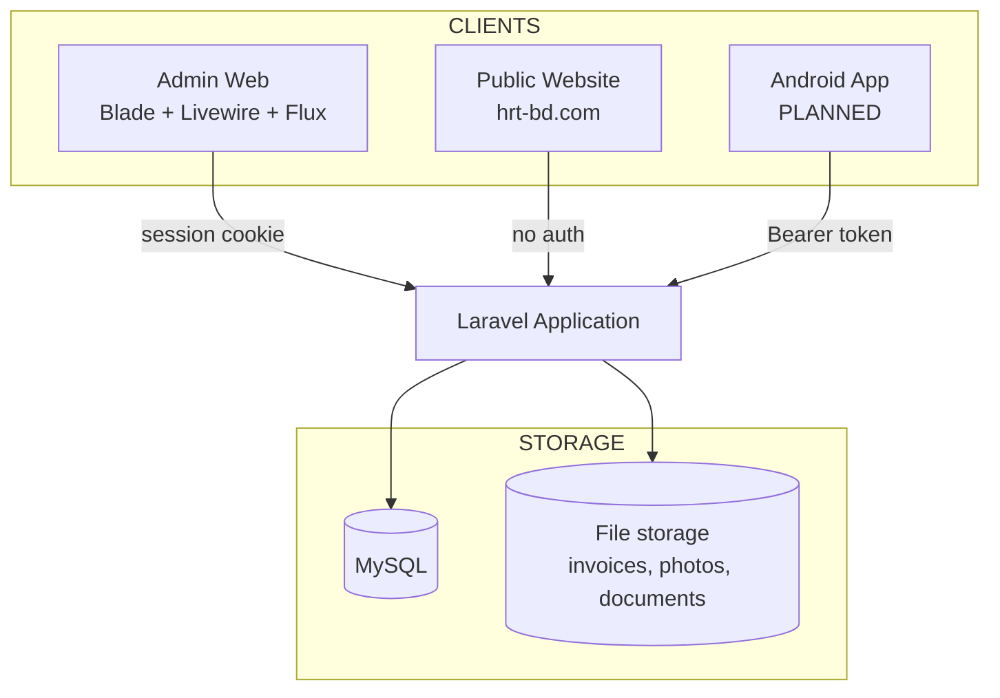
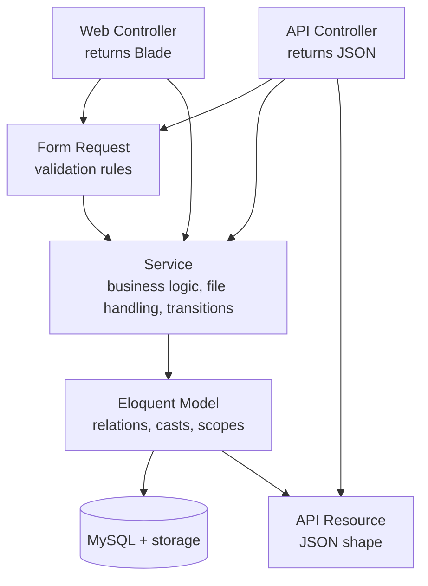
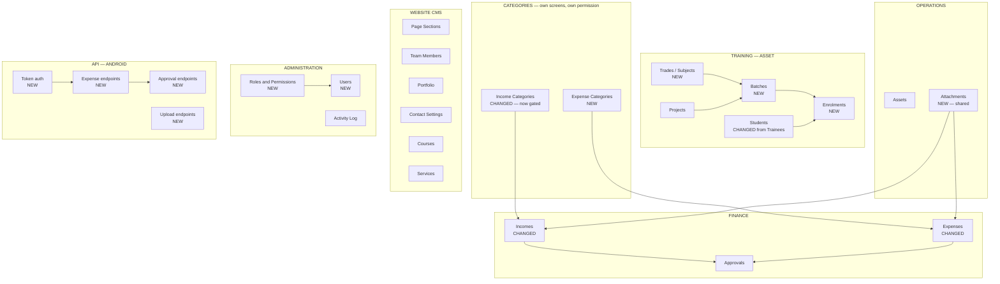
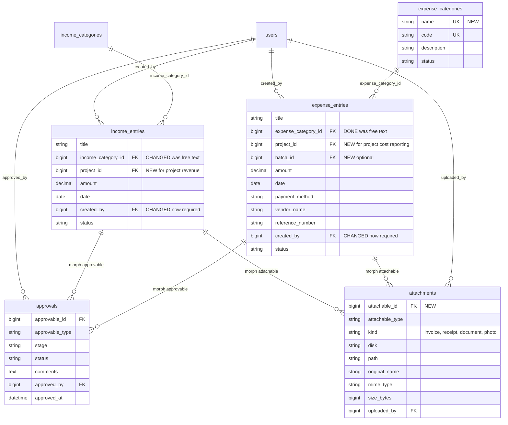
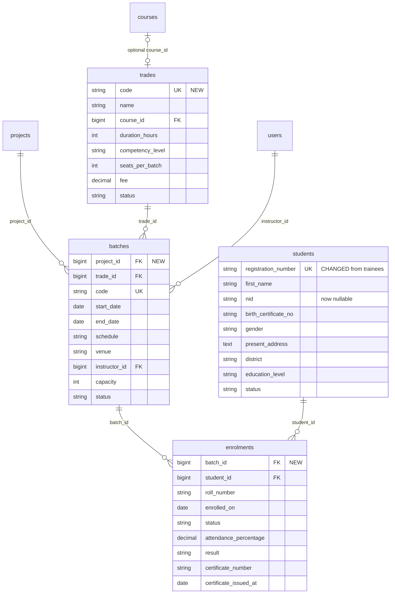
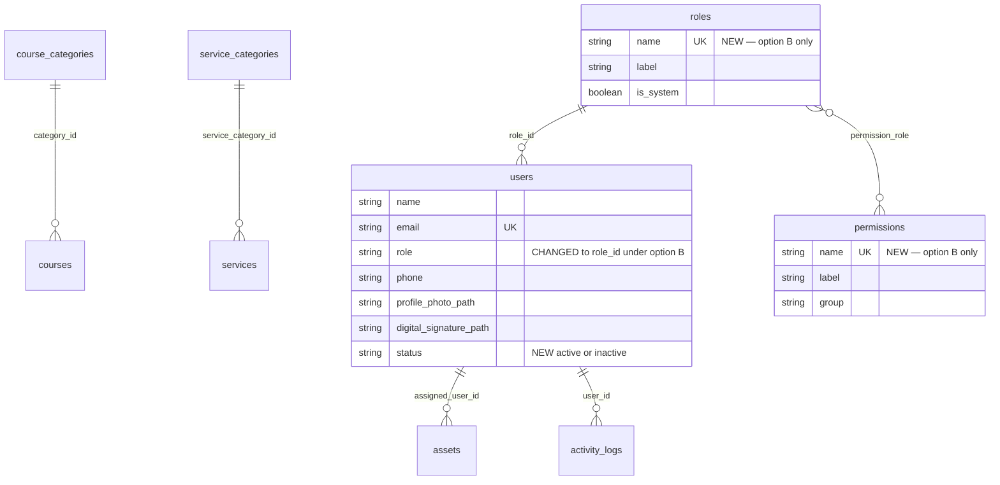
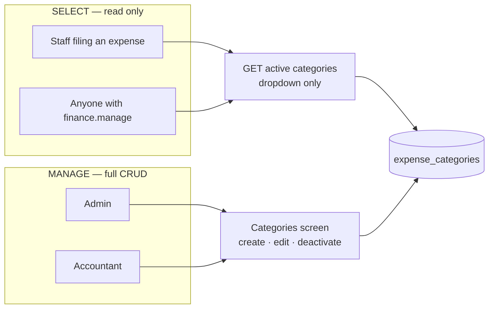
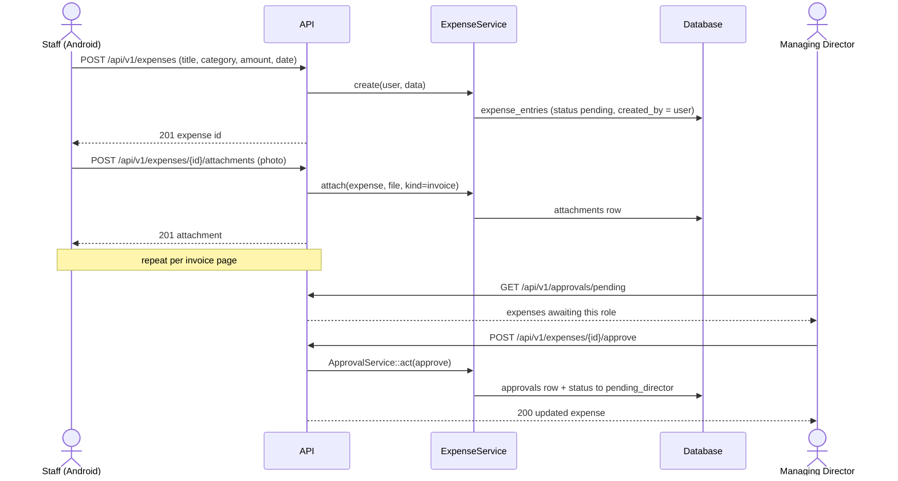
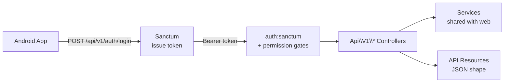
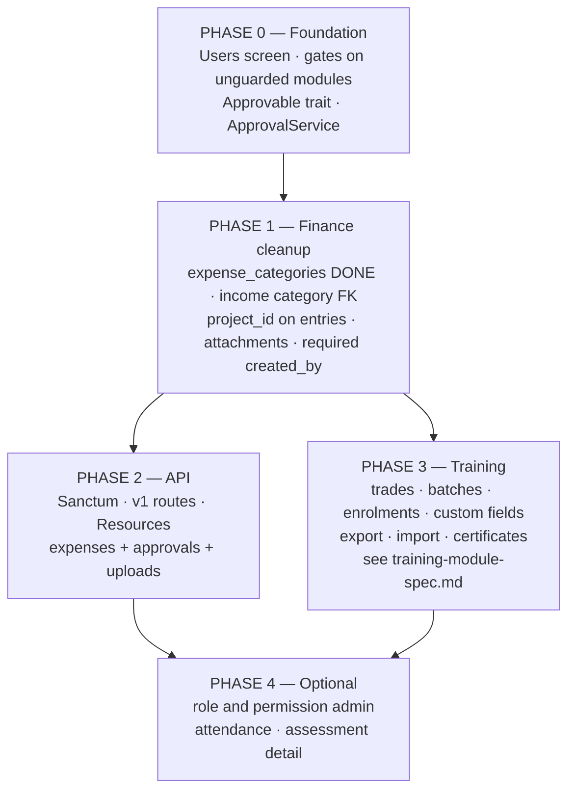

# Target Architecture

The structure of the full application — where it lands after the refurbish, not where it is today.

Read this before writing any migration. It exists so the whole shape is agreed up front, rather than
discovered halfway through.

- Current state, field by field: [`admin-modules-and-fields.md`](admin-modules-and-fields.md)
- Current routes, middleware and authorization: [`backend-map.md`](backend-map.md)
- Training in detail — custom fields, import/export, certificates: [`training-module-spec.md`](training-module-spec.md)

**Scope of this document.** Website CMS for hrt-bd.com, office management (income, expense, approvals,
assets), student training for the ASSET project, role and permission management, and a JSON API for the
Android app.

---

## 1. System context

Three clients, one Laravel application, one database.

The Android app is the reason several decisions below go the way they do. A second client means business
logic can no longer live inside a web controller, because two entry points now need the same rules.

---

## 2. Layered architecture

### 2.1 The problem to solve

Today every controller does its own validation inline and talks straight to Eloquent. That works with one
client. With two, every rule would have to be written twice — once for the web form and once for the API —
and they would drift.

### 2.2 Target

Three shared pieces, written once and used by both lanes:

| Layer | Holds | Example |
| --- | --- | --- |
| **Form Request** | Validation rules only | `StoreExpenseRequest` — same rules for the web form and the app |
| **Service** | Business logic, file handling, state transitions | `ExpenseService::create()`, `ApprovalService::act()` |
| **API Resource** | JSON shape for the app | `ExpenseResource` — one definition of what an expense looks like on the wire |

The web controller renders Blade; the API controller returns a Resource. Neither contains rules.

### 2.3 What this replaces

| Today | Target |
| --- | --- |
| `$request->validate([...])` inline in each action | `StoreExpenseRequest` / `UpdateExpenseRequest` |
| `approve()` copy-pasted in two controllers | `ApprovalService`, plus an `Approvable` trait on the models |
| Status constants duplicated across `IncomeEntry` and `ExpenseEntry` | One `Approvable` trait |
| `/data` endpoints returning pre-rendered HTML strings | Stay for DataTables; the app uses the JSON API instead |

The `/data` DataTables endpoints return HTML `<button>` markup inside JSON. They are fine for the admin
tables but unusable from Android, which is why the API is a separate surface rather than a reuse of them.

---

## 3. Module map

---

## 4. Domain model

Split into three diagrams so each stays readable. `NEW` marks a table that does not exist yet.

### 4.1 Finance

### 4.2 Training — ASSET

`trainees` keeps its table name unless you want the rename; "Students" is the label in the UI either way.
Full field lists are in [`admin-modules-and-fields.md` section 3.4](admin-modules-and-fields.md).

### 4.3 CMS, assets and administration

`page_sections`, `team_members`, `portfolio_items` and `contact_settings` are unchanged and have no
relations — see the field tables in the companion document.

---

## 5. Expenses — the changes you asked for

Three changes, all on the expense module.

### 5.1 Categories

`expense_entries.expense_category` is a free string today, with no table behind it. The same category ends
up spelled three ways and cannot be reported on.

New `expense_categories` table, mirroring `income_categories` but with a code for reporting:

| Field | Type | R | Notes |
| --- | --- | :-: | --- |
| `name` | string(255) unique | ✓ | e.g. "Training Materials" |
| *`code`* | string(50) unique | | Short code for reports, e.g. `TRN-MAT` |
| *`description`* | text | | |
| `status` | string(20) | ✓ | `active` / `inactive`, default `active` |

Then on `expense_entries`: add `expense_category_id` FK, backfill by matching the existing strings, drop
the old `expense_category` column.

Do the same on the income side — `income_entries.source_category` becomes `income_category_id`, pointing at
the `income_categories` table you already have and currently do not use as a FK.

### 5.2 How categories work everywhere — the rule

Every kind of category is **its own table, its own screen, and its own manage permission.** Listing them is
a separate, weaker right than changing them.

This matters because most people who file an expense should be able to *pick* a category from a dropdown
but must not be able to rename or delete one. Renaming a category that a hundred entries already point at
silently rewrites your reports; deleting one breaks them.

Applied across the application:

| Category table | Used by | Manage permission | Who may select |
| --- | --- | --- | --- |
| `expense_categories` **NEW** | Expenses | `finance.categories.manage` | Anyone with `finance.manage` or `finance.view` |
| `income_categories` | Incomes | `finance.categories.manage` | Anyone with `finance.manage` or `finance.view` |
| `project_categories` | Projects | `projects.manage` | Anyone with `projects.view` |
| `trades` | Batches | `training.manage` | Anyone with `training.view` |
| `course_categories` | Courses | `cms.manage` | Anyone with `cms.manage` |
| `service_categories` | Services | `cms.manage` | Anyone with `cms.manage` |

Three consequences for the build:

1. **`finance.categories.manage` is a new permission**, held by `admin` and `accountant` only. It is
   deliberately *not* implied by `finance.manage` — otherwise everyone who can file an expense could also
   delete the category list.
2. **A list endpoint is not a management endpoint.** `GET /expense-categories` returns active categories
   only and is open to anyone who can create an expense. The create, update and delete actions sit behind
   `finance.categories.manage`.
3. **Never hard-delete a category that is in use.** Deactivate instead — set `status` to `inactive` so it
   disappears from new dropdowns while existing entries keep resolving. Only allow a real delete when the
   usage count is zero.

Right now `Finance\IncomeCategoryController` has **no permission check at all** — any logged-in user can
create and delete income categories. That is one of the five unguarded modules in `backend-map.md`, and this
is the permission that fixes it.

### 5.3 User on the expense

`created_by` exists but is **nullable**, so an expense can have no owner. Target:

- Make `created_by` **required** (NOT NULL). Backfill any orphans first.
- Always set it server-side from the authenticated user — never accept it from the request body. This
  matters most on the API, where the app must not be able to file an expense as someone else.
- Show it in the list and detail screens, and add a "my expenses" filter.

If you reimburse staff for money they spent personally, add a second optional FK `paid_by` — the person
owed the money, who is not always the person entering the record. Left out of the schema above because I
do not know whether you do reimbursements. See the open questions.

### 5.4 Invoice photos

Today an expense holds **one** file in `attachment_path`, and uploading a replacement deletes the old one.
An expense normally has several invoice pages, and from a phone you will photograph them one at a time.

Use one polymorphic `attachments` table for the whole application rather than adding more `*_path` columns:

| Field | Type | R | Notes |
| --- | --- | :-: | --- |
| `attachable_id` + `attachable_type` | morphs | ✓ | Expense, income, student, asset — anything |
| `kind` | string(30) | ✓ | `invoice`, `receipt`, `document`, `photo` |
| `disk` | string(30) | ✓ | Default `public` |
| `path` | string(255) | ✓ | |
| `original_name` | string(255) | ✓ | What the user's file was called |
| `mime_type` | string(100) | ✓ | Lets the app decide image vs PDF |
| `size_bytes` | unsigned bigint | ✓ | |
| *`uploaded_by`* | FK → users | | |
| `sort_order` | int | ✓ | Page order for multi-page invoices |

This is the same pattern as `approvals`, which is already polymorphic — so it is a shape the codebase
already uses.

Migration path: create the table, copy every non-null `attachment_path` from `income_entries` and
`expense_entries` into it as `kind = 'invoice'`, then drop the two columns.

Practical limits worth setting now: images and PDFs only, roughly 10 MB per file, maybe 10 files per
expense. Phone cameras produce large files, so resize on upload rather than storing 12 MP originals.

### 5.5 Expense lifecycle, including the app

Create first, attach after. That way a photo upload that fails on a poor connection can be retried without
losing the typed fields.

---

## 6. API layer for Android

### 6.1 What exists today

One route — `GET /api/income/categories` — unauthenticated, returning raw model JSON. There is no `api`
guard in `config/auth.php`, and neither Sanctum nor Passport is installed. The `AddApiKeyHeader` middleware
puts `X-API-KEY` on the **response** and validates nothing.

So the API is effectively a blank page. That is good news for the app — nothing to unpick.

### 6.2 Target

Decisions:

| Question | Answer | Why |
| --- | --- | --- |
| Auth | **Laravel Sanctum**, personal access tokens | Built for exactly this; simpler than Passport, no OAuth flows needed for a first-party app |
| Versioning | `/api/v1/...` | The app ships to phones and cannot be force-updated |
| Shape | API Resources, never raw models | Raw models leak columns and break the app when the schema changes |
| Auth on writes | `created_by` from the token, never from the body | Otherwise the app can file records as another user |
| `AddApiKeyHeader` | **Remove it** | It emits a secret and checks nothing |
| Errors | Consistent JSON envelope with a code and a message | The app needs to branch on failures, not parse prose |

### 6.3 Endpoints for phase one

Enough for a staff expense-filing app plus an approver inbox.

| Method | Endpoint | Purpose |
| --- | --- | --- |
| POST | `/api/v1/auth/login` | Email + password, returns a token. Must handle the 2FA challenge |
| POST | `/api/v1/auth/logout` | Revoke the current token |
| GET | `/api/v1/auth/me` | Current user, role and permission list |
| GET | `/api/v1/expense-categories` | Active categories, for the picker. Read-only — see below |
| GET | `/api/v1/expenses` | Paginated, filterable by status, date range, mine |
| POST | `/api/v1/expenses` | Create |
| GET | `/api/v1/expenses/{id}` | Detail with attachments and approval history |
| PUT | `/api/v1/expenses/{id}` | Update while still editable |
| POST | `/api/v1/expenses/{id}/attachments` | Upload one invoice image |
| DELETE | `/api/v1/attachments/{id}` | Remove an attachment |
| GET | `/api/v1/approvals/pending` | The approver's inbox for their stage |
| POST | `/api/v1/expenses/{id}/approve` | `action` = approve, reject or send_back |
| GET | `/api/v1/incomes` … | Same set for income, once expense is proven |

**The app gets no category management endpoints.** `GET /expense-categories` returns active categories for
the dropdown and is available to anyone who can file an expense. Creating, editing and deleting categories
stays on the web admin behind `finance.categories.manage`. The phone is for filing expenses, not for
restructuring the chart of accounts.

Two things the app forces that the web admin has been able to avoid:

1. **Pagination must be real.** The `/data` endpoints page through DataTables parameters. The API needs
   ordinary `page` and `per_page` with a meta block.
2. **The 2FA challenge needs an API path.** Fortify's challenge is a web redirect. Logging in from the app
   with 2FA enabled needs a token-based two-step login, or an app-specific token issued from the web admin.
   Decide this before building the login screen.

---

## 7. Permissions

Current permissions stay. New ones for the modules being added:

| Permission | Covers | Held by |
| --- | --- | --- |
| `finance.categories.manage` | CRUD on income and expense categories | `admin`, `accountant` |
| `training.view` | See students, batches, enrolments | Training staff and above |
| `training.manage` | Create and edit them | `admin`, training staff |
| `students.manage` | Register and edit student records | `admin`, training staff |
| `projects.view` / `projects.manage` | Projects and project categories — currently unguarded | `admin`, project staff |
| `users.manage` | Already defined, currently unused — wire it to the new Users screen | `admin`, `superadmin` |

### 7.1 Manage versus select

The category permissions above follow the rule in [section 5.2](#52-how-categories-work-everywhere--the-rule):
**listing is not managing.** Two roles that both file expenses can differ on whether they may edit the
category list.

| Role | File an expense | Pick a category | Edit the category list |
| --- | :-: | :-: | :-: |
| `admin` | ✓ | ✓ | ✓ |
| `accountant` | ✓ | ✓ | ✓ |
| `chairman` · `managing_director` · `director` | — | ✓ (read-only views) | — |
| Future staff role | ✓ | ✓ | — |

That last row is the case that matters. Right now you have no role that can file an expense without also
being able to delete the category list, because `Finance\IncomeCategoryController` checks nothing at all
and expense categories are free text. Once categories are a table with their own permission, you can add a
plain staff role for the Android app that files expenses and picks categories and nothing more.

### 7.2 Fixes that belong in this work

Two, both from `backend-map.md`:

- Five modules currently have **no permission check at all** — projects, project categories, trainees,
  income categories and the activity log. Anything the refurbish touches should get a gate.
- `canBeApprovedBy()` checks the role string directly, so `approvals.manage` does nothing and a superadmin
  cannot approve. Move it onto the permission system while the approval code is being extracted into
  `ApprovalService`.

Also note: **there is currently no way to create a user.** No Users screen, and registration is disabled in
`config/fortify.php`. See [`admin-modules-and-fields.md` section 3.7](admin-modules-and-fields.md) — including
the warning about what happens if registration is simply switched back on.

---

## 8. Build order

Why this order:

- **Phase 0 first** because you cannot currently create a user, which blocks everything staffing-related,
  and because extracting `ApprovalService` before the API is built means it gets written once rather than
  twice.
- **Phase 1 before phase 2** because the app should be built against the final expense shape. Shipping an
  app against `expense_category` as a string and then changing it forces an app release.
- **Phases 2 and 3 are independent** and can run in parallel if there is more than one person.

---

## 9. Open questions

Carried forward, plus new ones from the API and expense work.

**Expenses and the app**

1. **Reimbursements.** Is the person entering an expense always the person who spent the money? If not,
   `expense_entries` needs a `paid_by` alongside `created_by`.
2. **Editing after submission.** Can a staff member edit an expense once it is `pending`, or only while it
   is a draft? There is no draft state today — everything starts at `pending`.
3. **Offline capture.** Should the app queue expenses taken with no signal and sync later? That changes the
   API (client-generated ids, idempotency keys) and is much cheaper to decide now than to retrofit.
4. **2FA on the app.** Every user has 2FA. How should the app log in — a token-based two-step challenge, or
   app tokens generated from the web admin?

**Training**

5. **Competency levels.** NTVQF 1–6, or your own basic/intermediate/advanced scale?
6. **Attendance.** Per-session, or one percentage per enrolment?
7. **Certificates.** Issued from the system with a number and a verification page, or only recorded?
8. **One project or many?** Is ASSET the only training project, or will others run alongside it?

**Administration**

9. **Roles.** Option A (Users screen, roles stay in code) or option B (roles and permissions in the
   database, editable from the admin)? This is the one that most changes how much work phase 4 is.
