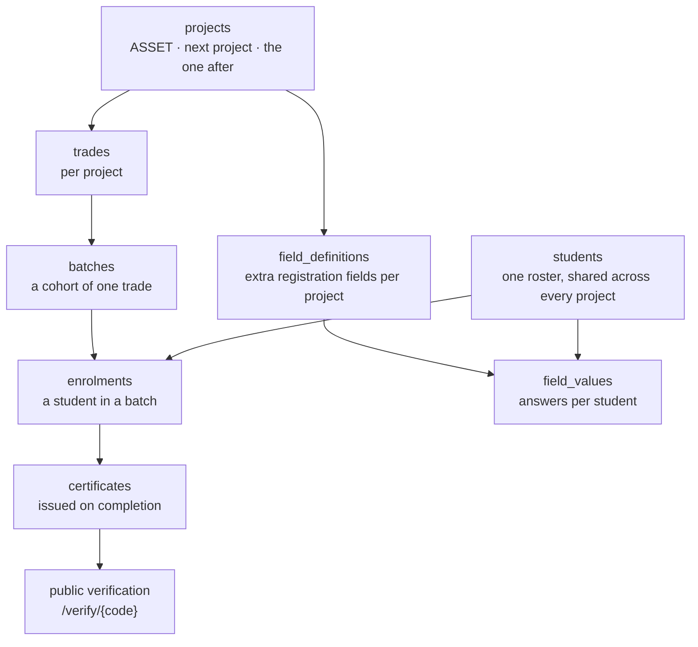
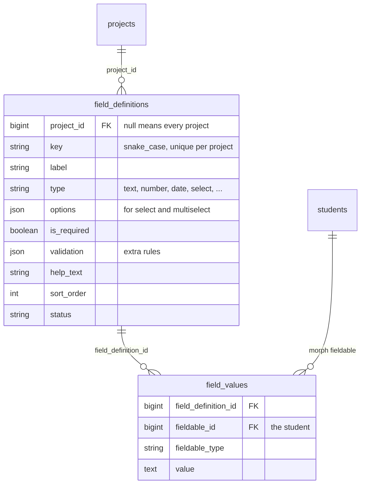
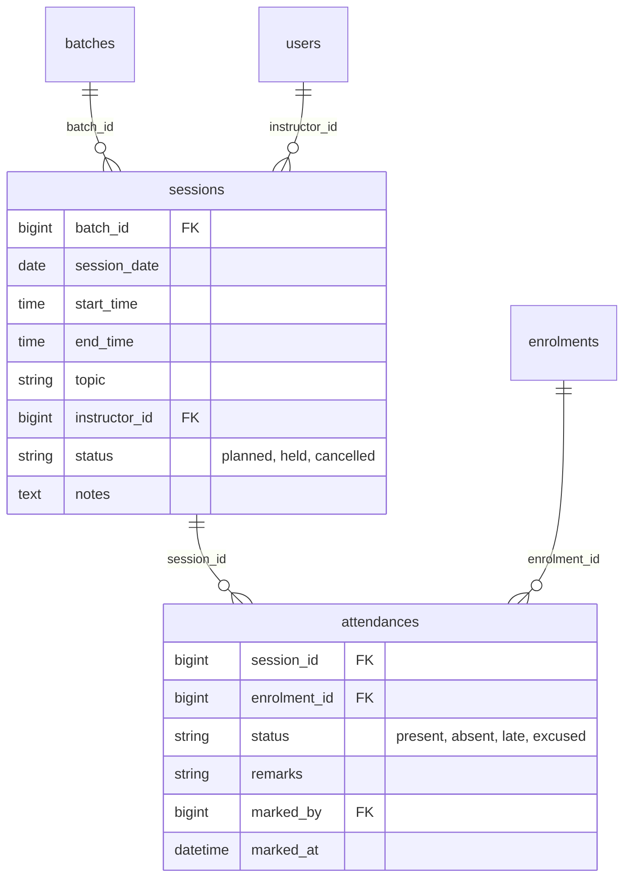
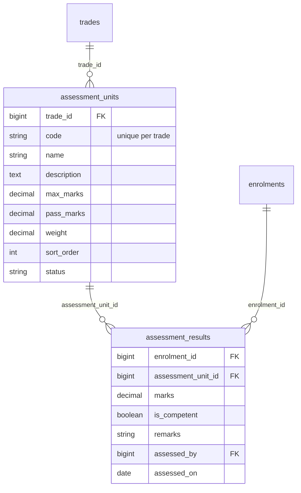
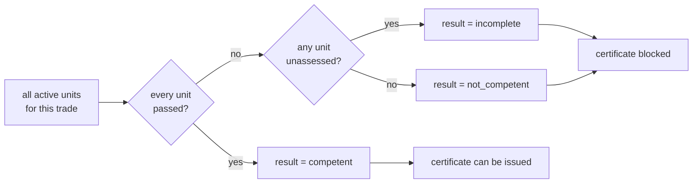
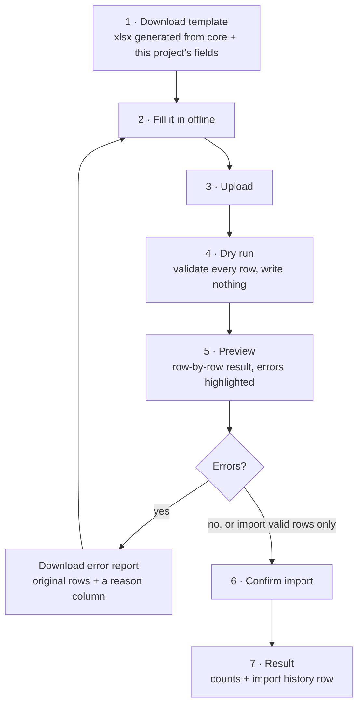
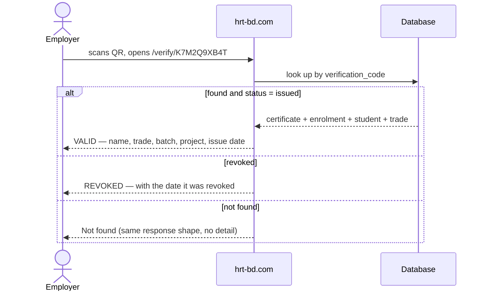
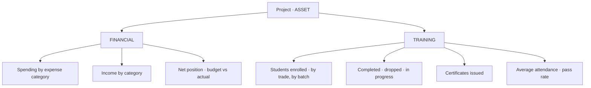
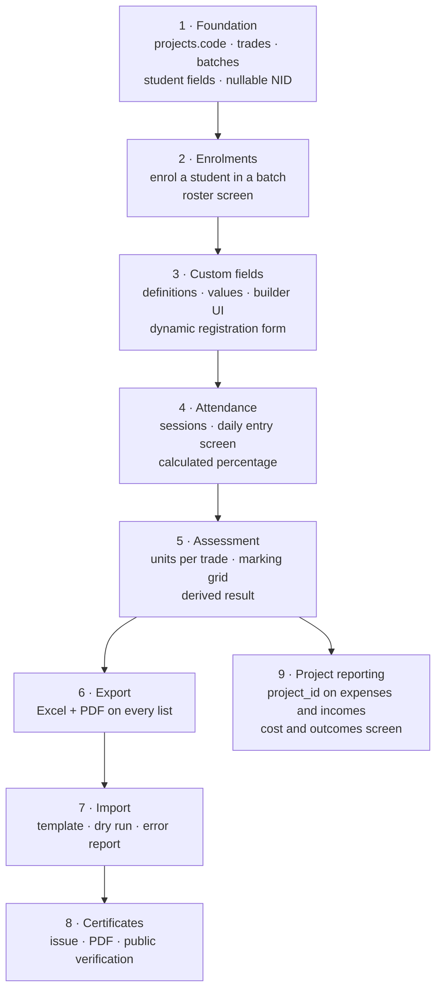

# Training Module Specification

The student training system: multi-project, custom registration fields, Excel and PDF import/export, and
verifiable certificates.

- Overall system shape: [`target-architecture.md`](target-architecture.md)
- Current admin, field by field: [`admin-modules-and-fields.md`](admin-modules-and-fields.md)

**Nothing in this document exists yet.** No `trades`, `batches`, `students`, `enrolments`, `certificates`
or custom-field tables are in the database today. This is the spec to build against.

Decisions already taken:

| Decision | Choice |
| --- | --- |
| Student roster | Extend the existing `trainees` table, do not build a parallel one |
| Registration | Admin-entered; no public application form for now |
| Trades | Separate from the CMS `courses` table; optional link to a marketing page |
| Custom fields | **Per project**, on top of shared core fields |
| Excel / PDF | `maatwebsite/excel` + `barryvdh/laravel-dompdf` |
| Competency levels | Dropdown of levels 1–6, stored as a **string** not a DB enum, so other scales can be added later |
| Attendance | **Per session**, with a daily entry screen. The percentage is calculated, never typed |
| Assessment | **Per competency unit**, marks or competent/not. The overall result is derived |
| Certificates | Issued from the system: number, PDF, and a public verification page |
| Projects | Several training projects will run alongside each other. Nothing is ASSET-specific |
| Project spending | Expenses and incomes gain a `project_id` so cost per project can be reported |

---

## 1. Projects are the top level

ASSET is one row in `projects`, not a special case. Everything below scopes to a project so a second and
third project can run alongside it with different trades, different registration fields and separately
numbered certificates.



Two things follow from projects being the top level:

- **A student is registered once, ever.** The same person can enrol in an ASSET batch this year and a
  different project's batch next year. That is why `enrolments` is a separate table.
- **`projects` needs a `code`.** Certificate numbers and trade codes are built from it, so it must be short,
  unique and stable: `ASSET`, not "ASSET Project Phase 2".

### Change to `projects`

| Field | Type | R | Notes |
| --- | --- | :-: | --- |
| `code` | string(20) unique | ✓ | **NEW.** Short identifier used in certificate numbers |
| `is_training` | boolean | ✓ | **NEW.** Default false. Only training projects get trades, batches and students |

Everything else on `projects` stays as it is today.

### Competency levels on `trades`

`trades.competency_level` is a **`string(50)`, not a database enum.** The form offers a dropdown of
Level 1 through Level 6, but the column accepts anything.

That combination is deliberate: the dropdown keeps the data clean today, while a string column means a
future project using a different scale needs no migration. A DB enum would need one, and altering an enum
on a large table locks it.

The six options live in `config/training.php` so they can be changed without touching code:

```php
'competency_levels' => [
    'Level 1', 'Level 2', 'Level 3',
    'Level 4', 'Level 5', 'Level 6',
],
```

---

## 2. Custom registration fields

### 2.1 The shape

Core fields live as real columns on `students` — name, NID, phone, photo, address. They are the same for
every project and every report depends on them, so they are not custom.

Anything a specific project needs on top is a **field definition** owned by that project.



### 2.2 `field_definitions`

| Field | Type | R | Notes |
| --- | --- | :-: | --- |
| *`project_id`* | FK → projects | | **Null means the field applies to every project.** Use this for organisation-wide extras |
| `key` | string(50) | ✓ | `snake_case`. Unique per project. Used as the import column header and the export column |
| `label` | string(150) | ✓ | What the form shows |
| `type` | string(20) | ✓ | See the type table below |
| *`options`* | json | | Choices for `select` / `multiselect` / `radio` |
| `is_required` | boolean | ✓ | Default false |
| *`validation`* | json | | Extra Laravel rules, e.g. `{"max": 11, "regex": "..."}` |
| *`help_text`* | string(255) | | Shown under the input |
| *`placeholder`* | string(150) | | |
| `sort_order` | int | ✓ | Field order on the form |
| `status` | string(20) | ✓ | `active` / `inactive`. Inactive fields stop appearing on new forms but existing values survive |

Unique on `(project_id, key)`.

Supported types:

| Type | Stored as | Notes |
| --- | --- | --- |
| `text` | string | |
| `textarea` | string | |
| `number` | numeric string | Validation can set min/max |
| `date` | `Y-m-d` | |
| `select` | string | One of `options` |
| `multiselect` | JSON array | |
| `radio` | string | |
| `checkbox` | `"1"` / `"0"` | Single yes/no |
| `file` | attachment id | Goes through the shared `attachments` table |

### 2.3 `field_values`

| Field | Type | R | Notes |
| --- | --- | :-: | --- |
| `field_definition_id` | FK → field_definitions | ✓ | Cascade on delete |
| `fieldable_id` + `fieldable_type` | morphs | ✓ | Polymorphic so the same engine can later serve assets or expenses |
| *`value`* | text | | Cast on read according to the definition's `type` |

Unique on `(field_definition_id, fieldable_id, fieldable_type)`.

**Why polymorphic:** the codebase already uses morphs for `approvals`, and the planned `attachments` table
is the same shape. Building the field engine polymorphically costs nothing now and means the next module
that needs custom fields does not need a second engine.

**Indexing note:** reporting queries like "every student where `household_income` is under X" hit
`field_values.value`, which is a `text` column. Add a prefix index (`value(191)`) and expect these queries
to be slower than core-column queries. If one custom field becomes central to reporting, promote it to a
real column on `students`.

### 2.4 The field builder screen

Admin → Projects → *a project* → Registration Fields.

- Drag to reorder, which writes `sort_order`.
- Live preview of the form as it will appear to the person registering a student.
- Changing `key` after values exist is blocked — it would orphan every stored answer. Change the `label`
  instead; the label is what people see.
- Deleting a definition that has values is blocked, same rule as expense categories: **deactivate instead.**
  Only allow a true delete at zero values.

### 2.5 Rendering

The registration form is core fields, then the project's active definitions ordered by `sort_order`.
Validation rules are assembled at runtime: `is_required` becomes `required`, `type` maps to a base rule,
and anything in `validation` is appended.

The same assembled rules are used by the web form, the importer and (later) the API, so a field defined
once behaves identically everywhere.

---

## 3. Attendance

Attendance is recorded **per session**, not as a typed percentage. The percentage on the enrolment becomes
a calculated figure that nobody can fudge.



### 3.1 `sessions`

| Field | Type | R | Notes |
| --- | --- | :-: | --- |
| `batch_id` | FK → batches | ✓ | |
| `session_date` | date | ✓ | Indexed with `batch_id` |
| *`start_time`* | time | | A batch can hold two sessions in a day, so date alone is not unique |
| *`end_time`* | time | | |
| *`topic`* | string(255) | | What was covered — feeds the batch log |
| *`instructor_id`* | FK → users | | Defaults to the batch instructor, overridable per session |
| `status` | string(20) | ✓ | `planned`, `held`, `cancelled`. Default `planned` |
| *`notes`* | text | | |
| *`created_by`* | FK → users | | |

Sessions can be **generated in bulk** from the batch: give a date range and the weekdays it runs, and the
system creates the `planned` rows. Editing individual sessions after that is normal — holidays get
cancelled, dates shift.

### 3.2 `attendances`

| Field | Type | R | Notes |
| --- | --- | :-: | --- |
| `session_id` | FK → sessions | ✓ | |
| `enrolment_id` | FK → enrolments | ✓ | Not `student_id` — attendance belongs to a specific enrolment |
| `status` | string(20) | ✓ | `present`, `absent`, `late`, `excused` |
| *`remarks`* | string(255) | | |
| `marked_by` | FK → users | ✓ | |
| `marked_at` | datetime | ✓ | |

Unique on `(session_id, enrolment_id)`.

### 3.3 How the percentage is calculated

```
attendance % = (present + late) / eligible sessions × 100
```

Three rules that matter, and each one is a bug if missed:

1. **Only `held` sessions count.** A cancelled class must not damage anybody's attendance.
2. **`excused` is excluded from the denominator**, not counted as absent. An approved absence should not
   penalise the student.
3. **Sessions before the student's `enrolled_on` date are excluded.** Someone who joins in week three must
   not start at 40%.

Store the result on `enrolments.attendance_percentage` as a cache, recalculated whenever attendance is
marked. Never let it be typed by hand.

### 3.4 The daily entry screen

The screen that gets used every day, so it has to be fast:

- Pick batch → pick date → the full roster loads with yesterday's layout.
- Everyone defaults to **present**; the marker only touches the exceptions. This is the single biggest
  time-saver and the reason not to default to blank.
- "Mark all present" / "mark all absent" buttons at the top.
- One tap per student cycles present → absent → late → excused.
- Saves without a page reload, with a clear saved indicator.
- Warn when marking a session already marked, and show who marked it and when.
- Works on a tablet — this gets done in a classroom, not at a desk.

---

## 4. Assessment

Each trade defines its own competency units; each student is marked against every unit; the overall result
is **derived**, never typed.



### 4.1 `assessment_units`

| Field | Type | R | Notes |
| --- | --- | :-: | --- |
| `trade_id` | FK → trades | ✓ | Units belong to the trade, so every batch of that trade is assessed the same way |
| `code` | string(30) | ✓ | e.g. `U1`, `CU-03`. Unique per trade |
| `name` | string(255) | ✓ | |
| *`description`* | text | | The competency statement |
| *`max_marks`* | decimal(6,2) | | Leave null for a pure competent / not-competent unit |
| *`pass_marks`* | decimal(6,2) | | |
| *`weight`* | decimal(5,2) | | Optional weighting toward the overall mark |
| `sort_order` | int | ✓ | |
| `status` | string(20) | ✓ | `active` / `inactive` |

Unique on `(trade_id, code)`.

### 4.2 `assessment_results`

| Field | Type | R | Notes |
| --- | --- | :-: | --- |
| `enrolment_id` | FK → enrolments | ✓ | |
| `assessment_unit_id` | FK → assessment_units | ✓ | |
| *`marks`* | decimal(6,2) | | Null for competent / not-competent units |
| *`is_competent`* | boolean | | |
| *`remarks`* | string(255) | | |
| `assessed_by` | FK → users | ✓ | |
| `assessed_on` | date | ✓ | |

Unique on `(enrolment_id, assessment_unit_id)`.

### 4.3 Deriving the overall result

A student is **competent** when every active unit for their trade is passed — `is_competent` is true, or
`marks >= pass_marks` where marks are used.



`enrolments.result` holds the derived value as a cache, recalculated on every result change. The
distinction between **incomplete** and **not_competent** matters: incomplete means the assessor has not
finished, not that the student failed, and only `competent` unlocks the certificate.

### 4.4 The marking screen

- Grid: students down, units across. The whole batch is marked in one screen.
- Enter marks or tick competent per cell, with per-column bulk fill.
- Each row shows the derived result live as cells are filled.
- A unit added to a trade after a batch has been assessed shows as unassessed rather than silently passing.

---

## 5. Import

### 5.1 Flow

Import is **per project**, because the custom-field columns depend on which project you are importing into.



**The dry run is the important part.** Nothing is written until the user has seen exactly what will happen.
A 400-row import that half-succeeds and leaves the operator guessing which rows landed is the failure mode
to design out.

### 5.2 Template

Generated per project, so it always matches the current field definitions:

| registration_number | first_name | last_name | nid | birth_certificate_no | phone | gender | date_of_birth | district | education_level | *(custom columns)* |
| --- | --- | --- | --- | --- | --- | --- | --- | --- | --- | --- |
| *(blank = auto)* | Rahim | Uddin | 1234567890123 | | 01711000000 | male | 1998-04-12 | Dhaka | SSC | ... |

- Row 1 is the header using the field `key`, not the label — keys are stable, labels are not.
- Row 2 is a filled example, visually distinct, and skipped on import.
- `select` columns get a dropdown restricted to the defined options.
- A hidden sheet carries the project id and a template version, so uploading last month's template into a
  project whose fields have changed is detected rather than silently mis-mapped.

### 5.3 Validation and duplicates

Every row is validated with the same assembled rules the web form uses. On top of that:

| Check | Behaviour |
| --- | --- |
| Duplicate `nid` in the file | Row fails — the file contradicts itself |
| `nid` already in `students` | Configurable per import: **skip**, **update the existing student**, or **fail** |
| Neither `nid` nor `birth_certificate_no` | Fails. A student needs one identifier |
| Unknown column in the upload | Warning, column ignored |
| Missing required custom field | Row fails |

Default is **skip**, because the safe assumption is that the operator is adding people, not rewriting
existing records.

### 5.4 `import_batches`

Every import is recorded, so there is an answer to "who loaded these 300 students and when".

| Field | Type | Notes |
| --- | --- | --- |
| `project_id` | FK → projects | |
| `user_id` | FK → users | Who ran it |
| `original_name` | string | The file they uploaded |
| `path` | string | Stored copy of the uploaded file |
| `total_rows` | int | |
| `imported_rows` | int | |
| `skipped_rows` | int | |
| `failed_rows` | int | |
| `status` | string | `pending`, `validating`, `previewed`, `importing`, `completed`, `failed` |
| *`error_report_path`* | string | The generated error xlsx |
| *`finished_at`* | datetime | |

Students created by an import carry `import_batch_id`, so a bad import can be identified and reversed.

### 5.5 Size

Read with `maatwebsite/excel` chunked reading, and import in chunks inside a transaction per chunk. Above
roughly 500 rows, push the import to a queued job and show progress against `import_batches`. Below that,
synchronous is fine and simpler.

---

## 6. Export

### 6.1 What exports

| Screen | Excel | PDF |
| --- | :-: | :-: |
| Students | ✓ | ✓ |
| Batch roster | ✓ | ✓ |
| Enrolments | ✓ | ✓ |
| Certificates issued | ✓ | ✓ |
| Expenses / Incomes | ✓ | ✓ |
| Assets | ✓ | ✓ |

### 6.2 Rules

- **Export what is on screen.** The export respects the current search, filters and sort. An export that
  ignores the filters the user just set is the most common complaint about export features.
- **Column chooser.** A dialog before download to pick columns, remembered per user per screen.
- Custom fields appear as columns using their `label`.
- Excel gets a frozen header row, auto-width, a title row naming the project and the filter applied, and
  the generation timestamp.
- PDF is landscape for wide tables, with the organisation header, page numbers, and the same filter caption.
- Amounts export as **numbers**, not `"৳ 1,500.00"` strings. A spreadsheet you cannot sum is not an export.
- Dates export as real dates.
- Bangla text needs a font embedded in the PDF — DejaVu Sans or a Bangla-capable face — or it renders as
  boxes. Set this up once in the DomPDF config.

---

## 7. Certificates and verification

### 7.1 Issuing

A certificate is issued against an **enrolment**, not a student — it certifies that this person completed
this trade in this batch under this project.

Preconditions: the enrolment's `status` is `completed` and `result` is a pass. Anything else cannot be
issued, and the button stays disabled with the reason shown.

| Field | Type | R | Notes |
| --- | --- | :-: | --- |
| `enrolment_id` | FK → enrolments, unique | ✓ | One live certificate per enrolment |
| `certificate_number` | string(60) unique | ✓ | Human-readable, printed on the document |
| `verification_code` | string(16) unique | ✓ | **Random**, used in the public URL |
| `issued_on` | date | ✓ | |
| `issued_by` | FK → users | ✓ | |
| `status` | string(20) | ✓ | `issued`, `revoked`, `reissued` |
| *`revoked_at`* | datetime | | |
| *`revoked_reason`* | string(255) | | |
| *`pdf_path`* | string | | Generated once and stored, so reprints are byte-identical |
| *`supersedes_id`* | FK → certificates | | Set when reissuing after a correction |

**Certificate number** is readable and derived: `HRT-ASSET-ELEC-2026-00042` —
organisation, project code, trade code, year, sequence within that scope.

**Verification code** is different on purpose: a short random string like `K7M2Q9XB4T`. It must **not** be
sequential or derivable from the certificate number, or anyone could enumerate every certificate you have
ever issued by counting upward.

### 7.2 Public verification

`GET /verify/{code}` — public, no login, linked from a QR code printed on the certificate.



**What the public page shows:** student name, photo (optional), trade, batch, project, issue date,
certificate number, and a clear valid / revoked banner.

**What it must never show:** NID, birth certificate number, phone, address, date of birth, or any custom
field. A verification page exists to confirm a claim, not to publish a student's personal file. This is
worth stating in the build ticket, because the natural implementation is to dump the enrolment relation
onto the page and that would leak the whole record.

Also required:

- Rate limit the route — 20 attempts per minute per IP. Without it, short codes are brute-forceable.
- Identical response shape and timing for "not found" and "revoked", so the page cannot be used to probe
  which codes exist.
- `noindex` on the page, so individual certificates do not end up in search results.

### 7.3 The document

DomPDF with an HTML template. Kept in `resources/views/pdf/certificate.blade.php`, with the organisation
logo, an authorised signature drawn from the issuing user's `digital_signature_path` — a column that already
exists on `users` and is currently unused — and the QR code.

QR generation needs one more package: `endroid/qr-code` renders an SVG locally with no external service.
**This is a third dependency beyond the two approved** — flagging rather than assuming. The alternative is
printing the verification URL as text, which works but is worse to use.

Bulk issuing: select completed enrolments in a batch, issue in one action, download a combined PDF.

---

## 8. What "professional and smooth" means here

Turning that into things that can actually be built and checked:

### 8.1 Every list screen

- Search, filter, sort and pagination that survive a page reload, in the URL.
- Filters visible as removable chips, plus a "clear all".
- Bulk selection with a sticky action bar — bulk enrol, bulk issue certificate, bulk export.
- Column chooser, remembered per user.
- Empty state that names the next action, not a blank table.
- Skeleton rows while loading, never a jumping layout.

### 8.2 Every form

- Inline validation on blur; the first error is focused and scrolled to on submit.
- Submit disables and shows a spinner, so nothing is double-posted.
- Unsaved-changes warning before navigating away.
- Autosave drafts on the long registration form — it can run to thirty fields with custom ones.
- Dates use one format everywhere: `dd MMM yyyy` on display, `Y-m-d` in inputs and exports.

### 8.3 Every negative outcome carries a reason

**Rule: if the system tells someone no, it must say why, and the reason is mandatory.**

Already enforced on the approval chain — rejecting or sending back an income or expense entry now requires
a reason, and it is shown to the submitter in a banner on the entry rather than buried in the history.
Apply the same rule everywhere a record takes a negative outcome:

| Outcome | Reason field | Required |
| --- | --- | :-: |
| Expense / income rejected | `approvals.comments` | ✓ done |
| Expense / income sent back | `approvals.comments` | ✓ done |
| Enrolment dropped | `enrolments.drop_reason` | ✓ |
| Enrolment failed | `enrolments.remarks` | ✓ |
| Certificate revoked | `certificates.revoked_reason` | ✓ |
| Import row failed | error report reason column | ✓ done in spec |
| Session cancelled | `sessions.notes` | ✓ |

An optional reason field is an empty reason field. Whoever is on the receiving end has to know what to fix,
and six months later somebody will ask why a certificate was revoked.

`enrolments` therefore gains a `drop_reason` string column, nullable at the database level but required by
validation when `status` is set to `dropped`.

### 8.4 Every destructive action

- Confirm dialog naming the specific record.
- Never delete a record other records depend on — deactivate. Already the rule for expense categories, and
  it applies to trades, batches and field definitions equally.
- Undo where it is cheap, a toast with an undo button.

### 8.5 Consistency

- One toast system, already `iziToast`.
- One modal pattern, already established in the categories screens.
- Esc closes, Enter submits, Tab order follows the visual order.
- Every screen works at 1280px wide without horizontal scrolling.

### 8.6 Speed

- Eager-load relations on every list — a roster of 200 students showing trade and batch must not run 400
  queries.
- Index every foreign key and every column that gets filtered on.
- Paginate everything. No screen loads an unbounded set.

---

## 9. Project reporting — cost and outcomes

You asked to see ASSET spending. That needs one change outside this module: **expenses and incomes have to
know which project they belong to.** Today they have no project link at all, so "what has ASSET cost us"
cannot be answered.

### 9.1 Change to `expense_entries` and `income_entries`

| Field | Type | R | Notes |
| --- | --- | :-: | --- |
| *`project_id`* | FK → projects | | **NEW** on both tables. Null means general office spending, not attributable to a project |
| *`batch_id`* | FK → batches | | **NEW** on `expense_entries` only. Optional, for costs traceable to one cohort |

Both nullable on purpose — office rent is not ASSET spending, and forcing a project onto every expense
would make people pick one at random, which is worse than null.

On the expense form the project becomes a dropdown next to the category. On the list screen it becomes a
filter, and the export gains a project column.

### 9.2 The project report screen

One screen per project, exportable to Excel and PDF like every other list.



The financial half answers "what has this project cost", broken down by the expense categories built last
turn. The training half answers "what did it deliver". Both are on one page because for a government
project those two numbers get reported together — cost per trained student is the figure that gets asked
for, and it needs both halves.

Filters: date range, trade, batch. Everything respects them, including the export.

### 9.3 A note on approved-only figures

Expenses move through the three-stage approval chain, so a spending report has to say which figure it is
showing. Default to **fully approved only**, with a toggle to include pending. A cost report that silently
includes unapproved expenses will not reconcile against the accounts.

---

## 10. Full table list

New tables this module adds:

| Table | Purpose |
| --- | --- |
| `trades` | The operational training unit. `competency_level` is a string, dropdown 1–6 |
| `batches` | A cohort running one trade under one project |
| `enrolments` | A student in a batch. `attendance_percentage` and `result` are both derived caches |
| `sessions` | One class day for a batch |
| `attendances` | One student's status for one session |
| `assessment_units` | Competency units, defined per trade |
| `assessment_results` | One student's mark for one unit |
| `field_definitions` | Custom registration fields, per project |
| `field_values` | The answers, polymorphic |
| `import_batches` | Import history and error reports |
| `certificates` | Issued certificates with verification codes |
| `attachments` | Shared file store, from `target-architecture.md` |

Twelve new tables. Changes to existing tables:

| Table | Change |
| --- | --- |
| `projects` | Add `code`, `is_training` |
| `trainees` | Add registration fields; **make `nid` nullable**; add `import_batch_id` |
| `expense_entries` | Add `project_id`, `batch_id` — both nullable |
| `income_entries` | Add `project_id` — nullable |

---

## 11. Build order



Why this order:

- **Attendance and assessment before certificates**, because a certificate can only be issued when the
  derived result says competent. Building certificates first would mean inventing a placeholder for a
  result that does not exist yet.
- **Export before import**, because the exporter builds the column mapping the importer needs and is far
  easier to get right first.
- **Custom fields before either**, because both have to handle them.
- **Project reporting can run in parallel** from step 5 onward — it only needs enrolment outcomes and the
  `project_id` columns, not certificates.

---

## 12. Open questions

1. **Certificate numbering.** Is `HRT-ASSET-ELEC-2026-00042` right, or does a government project mandate a
   format? If ASSET has a prescribed certificate format, that overrides this entirely. **This is the one
   most worth answering before step 8**, because reissuing certificates under a corrected format is painful.
2. **QR package.** Approve `endroid/qr-code` as a third dependency, or print the verification URL as text?
3. **Bangla on certificates.** English, Bangla, or both? Bilingual changes the PDF template and needs the
   font work done up front.
4. **Photo on the verification page.** Include the student photo so an employer can match the person, or
   leave it off as unnecessary exposure?
5. **Who may issue certificates?** A new `certificates.issue` permission, or is `training.manage` enough?
   Given a certificate is a legal-ish document, a separate permission is probably right.
6. **Attendance threshold.** Is there a minimum attendance percentage below which a student cannot be
   assessed or certified? Common in government training programmes, and easy to enforce if the rule exists.
7. **Marks or competency?** Section 4 supports both per unit. Do your trades use numeric marks, plain
   competent / not-competent, or does it vary by trade?
